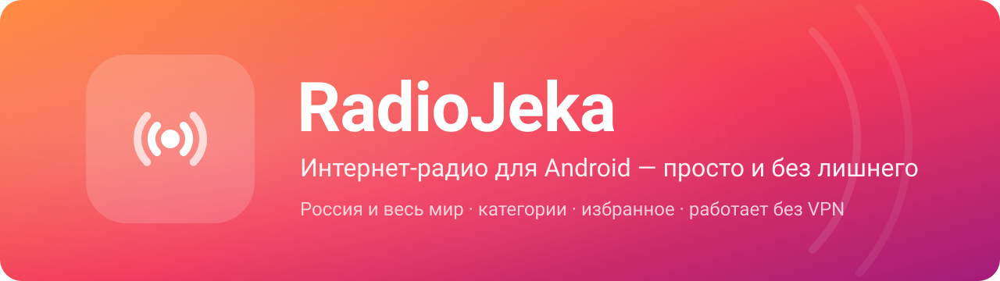
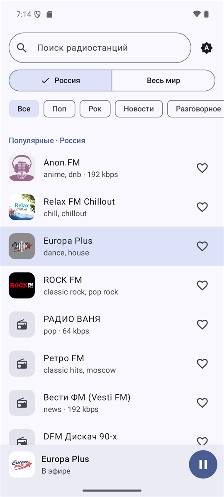
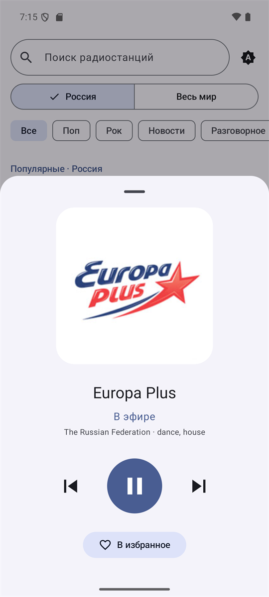
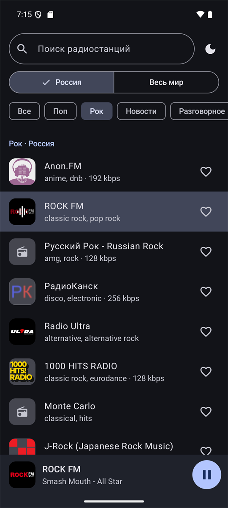
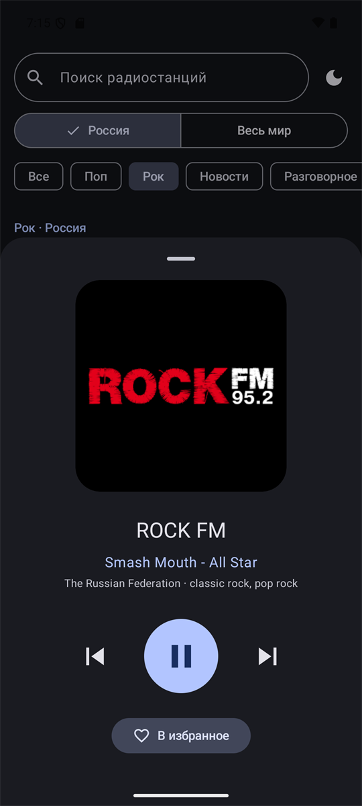
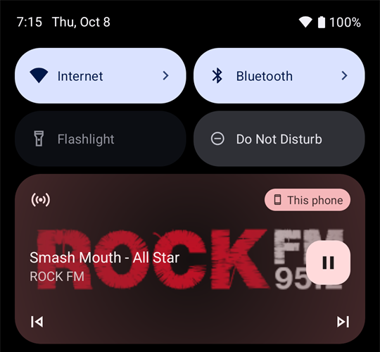

<p align="center">
  
</p>

<p align="center">
  <a href="https://github.com/WiverHome/RadioJeka/releases/latest"></a>
  <a href="https://github.com/WiverHome/RadioJeka/releases"></a>
  
  <a href="LICENSE"></a>
</p>

<p align="center">
  <a href="https://github.com/WiverHome/RadioJeka/releases/latest/download/RadioJeka.apk"><b>⬇ Скачать APK</b></a>
  &nbsp;·&nbsp;
  <a href="#установка">Как установить</a>
  &nbsp;·&nbsp;
  <a href="https://github.com/WiverHome/RadioJeka/releases">Все версии</a>
</p>

---

**RadioJeka** — простое приложение для прослушивания интернет-радио. Без регистрации, рекламы, аккаунтов и лишних экранов: открыл, выбрал станцию, слушаешь.

## Возможности

- 📻 **Тысячи станций.** Все радиостанции России и самые популярные в мире.
- 🇷🇺 **Работает без VPN.** Каталог встроен в приложение, поэтому список открывается сразу, даже если сайты каталогов недоступны.
- 🎸 **Категории:** поп, рок, новости, разговорное, танцевальная, электроника, хип-хоп, ретро, шансон, джаз, классика, лаунж, метал, фолк.
- 🔎 **Поиск** по названию с учётом региона и категории.
- ❤️ **Избранное** — любимые станции всегда наверху.
- 🎵 **Название песни**, если станция его передаёт.
- ⏭ **Переключение станций** кнопками «назад/вперёд» — в приложении, в уведомлении и на наушниках.
- 🔒 **Фоновое воспроизведение** с управлением с экрана блокировки; пауза, когда отключаются наушники.
- 🔁 **Автоматическое переподключение** при обрыве связи.
- 🌗 **Светлая и тёмная тема** (или как в системе), цвета Material You на Android 12+.

## Скриншоты

<p align="center">
  
  
  
  
</p>
<p align="center">
  
</p>

## Установка

1. Скачайте **[RadioJeka.apk](https://github.com/WiverHome/RadioJeka/releases/latest/download/RadioJeka.apk)** на телефон.
2. Откройте скачанный файл. Если Android спросит, разрешите установку из этого источника (браузера или «Файлов»).
3. Нажмите **«Установить»**.

> Google Play Защита может предупредить, что приложение ей незнакомо: оно распространяется не через Google Play. Нажмите «Подробнее» → «Всё равно установить».

Обновление — так же: скачайте новую версию и установите поверх, избранное и настройки сохранятся.

Требуется Android 8.0 или новее.

## Откуда станции

Каталог берётся из открытой базы [Radio Browser](https://www.radio-browser.info), которую ведут слушатели со всего мира. Снимок базы встроен в приложение; когда сайт доступен, приложение раз в сутки обновляет его в фоне. Сами трансляции идут напрямую с серверов радиостанций — приложение ничего не собирает и не отправляет.

Нашли станцию, которая не играет, или хотите добавить свою? Её можно исправить или добавить на [radio-browser.info](https://www.radio-browser.info), и она появится в RadioJeka.

## Для разработчиков

Kotlin, Jetpack Compose (Material 3), Media3 / ExoPlayer, Coil.

```bash
./gradlew assembleRelease
```

APK появится в `app/build/outputs/apk/release/`. Без файла `keystore.properties` сборка подписывается отладочным ключом.

Обновить встроенный каталог перед релизом (нужен доступ к radio-browser.info):

```bash
python tools/update_catalog.py
```

| Файл | Что внутри |
| --- | --- |
| `MainActivity.kt` | весь интерфейс: список, фильтры, мини-плеер и полный плеер, выбор темы |
| `RadioViewModel.kt` | состояние экрана, очередь станций, связь с плеером |
| `PlaybackService.kt` | фоновое воспроизведение, уведомление, переподключение, название трека |
| `StationCatalog.kt` | встроенный каталог, поиск и фильтры офлайн, ежедневное обновление |
| `RadioApi.kt` | запросы к Radio Browser |

## Лицензия

[MIT](LICENSE). Названия и логотипы радиостанций принадлежат их владельцам.
